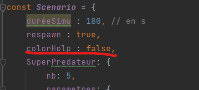
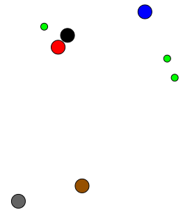
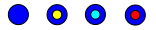
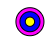
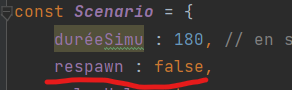

# SMA_TP
12/01 13h

dossier empty-example

MAJ pour 26/01 13h

dossier Vivarium

***
# Lancer le projet 

Pour lancer le projet, la méthode la plus simple est d'ouvrir le fichier index.html du dossier Vivarium. 
Si vous souhaitez utiliser un serveur, cela est possible avec browser-sync (il est nécessaire d'avoir Node.js installé).

```shell
npm i browser-sync -g
browser-sync start -serve
```

# Agents et Comportement

Dans notre simulation, nous pouvons différencier graphiquement les types d'agents, ainsi que leur type de comportement
et si l'agent est le meilleur agent en termes de génétique. Pour désactiver les visualisations graphiques des comportements
(et du meilleur agent en termes de génétique), veuillez mettre la valeur "colorHelp" à false dans le fichier
Vivarium/Parametres/scenario.js (par défaut il est activé).



Ensuite, nous allons expliquer les couleurs des agents et des comportements.


Coleur des agents : 
* Rouge pour les Superprédateurs
* Brun pour les Carnivores
* Bleu pour les Herbivores
* Gris pour les Décomposeurs
* Vert pour les Végétaux
* Noir pour les Morts



Pour chaque agent, nous allons également afficher leur comportement. Il existe 5 comportements :
* Mangeur

Ce comportement n'est accessible que lorsque l'on a faim. J'ai décidé de déclarer la faim des espèces un peu différente en fonction de l'espèce.

Le Superprédateur commence à ressentir la faim à partir de 55 % de sa jauge de faim (maximum).

Le Carnivore à partir de 50%.

L'Herbivore à partir de 30%.

Le Décomposeur à partir de 5%.

* Survie

Ce comportement est déclenché à partir de 2 critères différents :
1. L'agent n'a pas faim, mais il détecte un danger.
2. L'agent a faim, mais la proximité du danger est plus importante que celle de la proie.

* Symbiose

Ce comportement ne peut être déclenchée que par un herbivore.

Il se déclenche lorsque l'herbivore est dans le comportement "suivi" et qu'il trouve un superprédateur qui peut le sauver. Dans ce cas, il se dirigera vers le superprédateur.

* Random (dans le cas où l'on n'a pas faim et qu'il n'y a pas de danger)

Comportement par défaut, dans le cas où aucun des autres comportements n'a été déclenché.
* Dormir (ce comportement fonctionne un peu différemment des autres)

Ce comportement est le seul déclaré par la classe body.js. Lorsque la jauge de fatigue est pleine, l'agent s'endort.

Pour pouvoir visualiser leur comportement, j'ai ajouté un cercle au milieu avec des couleurs différentes :
* Random : Pas de color.
* Jeune : Comportement de "Mangeur".
* Bleu clair : Comportement de "Survie".
* Rouge : Comportement de "Symbiose" (comme le Superprédateur ne peut pas avoir ce comportement, je l'ai mis en rouge).
* Dormir : Pas de couleur, un agent qui dort ne bouge pas.

Voici une illustration des comportements d'un Herbivore : 

 

Comme mentionné précédemment, il est possible de désactiver l'affichage du comportement dans scenario.js.

En plus de cela, il est possible de voir quel agent est actuellement le meilleur agent en termes de génétique. 
Il est représenté par un contour violet (voir illustration). Il est également possible de désactiver cet affichage.




Pour décider quel individu a la meilleure génétique, j'utilise un fichier de paramètre que vous pouvez trouver dans : 
/Vivarium/Parametres/coefficientCapacity.js. Il est possible de décider le coefficient de chaque paramètre et de le 
modifier.

A la fin de chaque scénario, l'individu ayant eu la meilleure génétique tout au long de la partie est 
également affiché (dans l'écran).

# Console
Vous pouvez ouvrir la console en utilisant F12. Dedans, vous pouvez voir le pourcentage de la population (question 10) et 
l'individu ayant la meilleure génétique (question 11)

# Autres Parameters

Pendant certaines simulations, il peut arriver qu'une espèce disparaisse. 
Pour éviter qu'une espèce prenne le contrôle de toute la simulation (par exemple, s'il n'y a plus de superprédateurs, les carnivores domineront toute la simulation),
au moment où une espèce est éradiquée, nous faisons spawner un nouvel individu de cette espèce.

Evidemment, il est possible de désactiver ce paramètre dans Vivarium/Parametres/scenario.js (valeur "respawn"). Par défaut, elle est activée (true).



# Les questions manquantes 

Il y a deux questions que je n'ai pas implémentées dans notre simulation :
* Question 9

Pour des problèmes de CORS, nous n'utilisons pas de fichier JSON, nous utilisons un objet javascript. 
J'ai décidé de ne pas implémenter cette question, car elle n'aurait pas été fonctionnelle pour un fichier JSON.

* Question 12

En javascript, il est plus difficile d'implémenter cette question. J'ai essayé de l'implémenter avec une bibliothèque graphique
(javascript) mais cela impacte la performance de la simulation et masque une partie du jeu. J'ai décidé de l'enlever